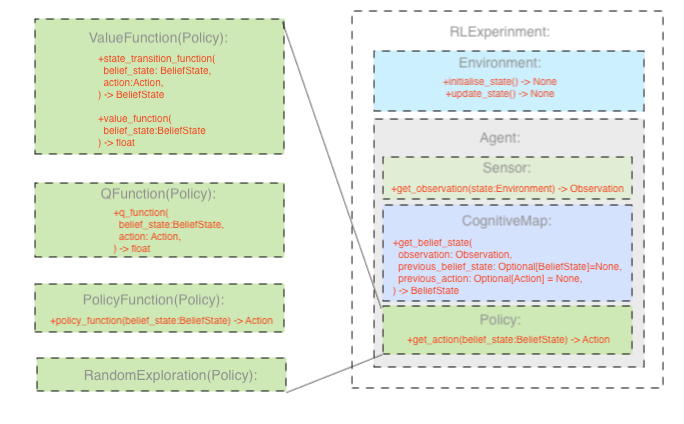

# Leen RL
A simple interface for writing modular RL experiments


Everything in red must is defined by the user (depending on the nature of the experiment).  The rest is handled in the background. 

## RLExperiment
Here is an example walk-through of how to set-up a leen rl experiment
```python
from leen_rl import RLExperiment

your_experiment = RLExperiment(
    environment = your_environment,
    agent = your_agent,
)
your_experiment.run(number_of_steps=1000)
```
TODO: functionality for learning and plotting

## Environment
When setting up your environment, you need only define two functions: `initialise_state()` and `update_state()` which is where you can define or integrate any environment into your experiment 
```python
from leen_rl import Environment

class YourWorld(Environment):
  def initialise_state(self) -> None:
    pass
    
  def update_state(self, action:Action) -> None:
    pass

your_environment = YourWorld()
```
We provide a few examples for you, some of which use environments from openAI gym

```python
from gym import make

class Racetrack(Environment):
    def initialise_state(self) -> None:
        self.environment = make("CarRacing-v0")
        self.pixels = self.environment.reset()
        self.environment.render()

    def update_state(self, action:Action) -> None:
        self.pixels,_, _, _ = self.environment.step(
            action = [action.steer, action.gas, action.brake]
        )
        self.environment.render()

your_environment = RaceTrack()
```

others of which define a custom environment using visualisation packages like turtles:
- 
```python
from turtle import Screen, Turtle

class TurtleWorld(Environment):
    def initialise_state(self) -> None:
        screen = Screen()
        self.agent = Turtle()
        self.agent_speed = 0
        self.step_size = 10

    def update_state(self, action:Action) -> None:
        self.agent_speed += action.acceleration
        self.agent.right(action.turn*self.step_size)
        self.agent.fd(self.agent_speed)

your_environment = TurtleWorld()
```

## Agent

TODO: integrate intrinsic rewards

## Sensor

## CognitiveMap

## Policy
Aswell as defining a custom policy, there are various kinds of pre-defined Policies to choose from, including PolicyFunction, ValueFunction, QFunction, GoalPlanning, etc.

TODO: PID controller in predefined policies

Actionspaces
TODO: allow for continual action spaces to be defined
